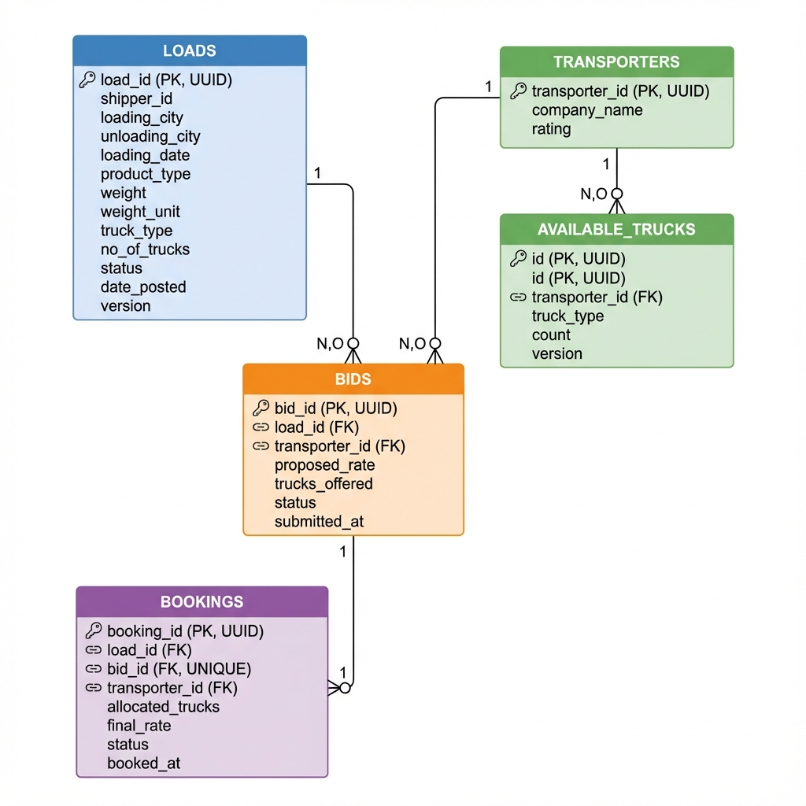
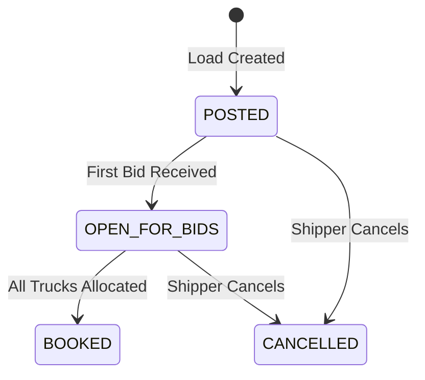
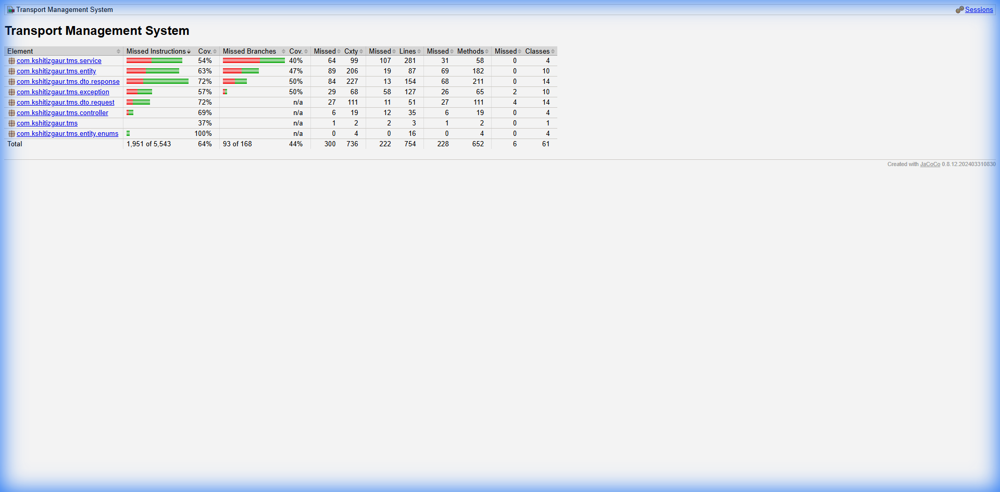

# 🚚 Transport Management System (TMS) - Backend

<div align="center">


**A production-grade RESTful API backend for managing transport logistics - loads, transporters, bidding, and bookings.**

[View API Docs](#-api-documentation) • [Quick Start](#-quick-start) • [Database Schema](#-database-schema) • [Business Rules](#-business-rules)

</div>

---

## 📋 Table of Contents

- [Overview](#-overview)
- [Features](#-features)
- [Technology Stack](#️-technology-stack)
- [Quick Start](#-quick-start)
- [Database Schema](#-database-schema)
- [API Documentation](#-api-documentation)
- [Business Rules](#-business-rules)
- [Testing](#-testing)
- [Project Structure](#-project-structure)
- [Author](#-author)

---

## 🎯 Overview

The Transport Management System (TMS) is a comprehensive backend solution that enables:

| Stakeholder | Capabilities |
|-------------|--------------|
| **Shippers** | Post loads, view bids, accept best offers, manage bookings |
| **Transporters** | Register fleet, submit competitive bids, manage truck capacity |
| **System** | Auto-calculate best bids, handle concurrent bookings, track allocations |

### Key Highlights
- ✅ **15 RESTful APIs** covering complete logistics workflow
- ✅ **5 Core Business Rules** for bid validation, capacity management, and concurrent booking prevention
- ✅ **Optimistic Locking** for thread-safe operations
- ✅ **Swagger/OpenAPI** documentation for easy API exploration
- ✅ **Comprehensive Testing** with JUnit 5 and integration tests

---

## ✨ Features

### Load Management
- Create, retrieve, and cancel shipment loads
- Filter loads by shipper, status, with pagination
- Automatic status transitions (POSTED → OPEN_FOR_BIDS → BOOKED)

### Transporter Management  
- Register transporters with fleet details
- Real-time truck capacity tracking
- Dynamic capacity updates

### Bidding System
- Submit competitive bids on loads
- Duplicate bid prevention
- **Smart Bid Scoring**: `score = (1/rate) × 0.7 + (rating/5) × 0.3`

### Booking System
- One-click bid acceptance
- Multi-truck allocation support
- Automatic capacity deduction and restoration

---

## 🛠️ Technology Stack

| Layer | Technology |
|-------|------------|
| **Framework** | Spring Boot 3.2.0 |
| **Language** | Java 17+ |
| **Database** | PostgreSQL 15+ / H2 (dev) |
| **ORM** | Spring Data JPA + Hibernate 6 |
| **Validation** | Jakarta Bean Validation |
| **API Docs** | SpringDoc OpenAPI 3.0 (Swagger) |
| **Testing** | JUnit 5, Mockito, Spring MockMvc |
| **Build** | Maven 3.8+ |
| **Coverage** | JaCoCo |

---

## 🚀 Quick Start

### Prerequisites

```bash
# Check Java version (17+ required)
java -version

# Check Maven version (3.8+ required)  
mvn -version
```

### Installation

```bash
# Clone the repository
git clone <repository-url>
cd cargoPro

# Build the project
mvn clean install -DskipTests

# Run with H2 database (development mode)
mvn spring-boot:run

# Or run with PostgreSQL
# First update application.properties with your PostgreSQL credentials
mvn spring-boot:run -Dspring.profiles.active=prod
```

### Access Points

| Resource | URL |
|----------|-----|
| 🌐 **Swagger UI** | http://localhost:8080/swagger-ui.html |
| 📄 **OpenAPI JSON** | http://localhost:8080/api-docs |
| 🗄️ **H2 Console** | http://localhost:8080/h2-console |

---

## 📊 Database Schema

### Entity-Relationship Diagram



### Tables Overview

```
┌─────────────────────────────────────────────────────────────────────────────┐
│                              LOADS                                          │
├─────────────────────────────────────────────────────────────────────────────┤
│ load_id (PK)    │ UUID      │ Primary identifier                           │
│ shipper_id      │ VARCHAR   │ Shipper reference                            │
│ loading_city    │ VARCHAR   │ Origin city                                  │
│ unloading_city  │ VARCHAR   │ Destination city                             │
│ loading_date    │ TIMESTAMP │ Pickup date/time                             │
│ product_type    │ VARCHAR   │ Cargo description                            │
│ weight          │ DECIMAL   │ Total weight                                 │
│ weight_unit     │ ENUM      │ KG, TONNE                                    │
│ truck_type      │ VARCHAR   │ Required truck type                          │
│ no_of_trucks    │ INTEGER   │ Trucks needed                                │
│ status          │ ENUM      │ POSTED, OPEN_FOR_BIDS, BOOKED, CANCELLED     │
│ version         │ BIGINT    │ Optimistic lock version                      │
└─────────────────────────────────────────────────────────────────────────────┘

┌─────────────────────────────────────────────────────────────────────────────┐
│                           TRANSPORTERS                                      │
├─────────────────────────────────────────────────────────────────────────────┤
│ transporter_id  │ UUID      │ Primary identifier                           │
│ company_name    │ VARCHAR   │ Transport company name                       │
│ rating          │ DECIMAL   │ Performance rating (1-5)                     │
└─────────────────────────────────────────────────────────────────────────────┘

┌─────────────────────────────────────────────────────────────────────────────┐
│                         AVAILABLE_TRUCKS                                    │
├─────────────────────────────────────────────────────────────────────────────┤
│ id              │ UUID      │ Primary identifier                           │
│ transporter_id  │ UUID (FK) │ Reference to transporter                     │
│ truck_type      │ VARCHAR   │ Type of truck (TRAILER, CONTAINER, etc.)     │
│ count           │ INTEGER   │ Number of available trucks                   │
│ version         │ BIGINT    │ Optimistic lock version                      │
└─────────────────────────────────────────────────────────────────────────────┘

┌─────────────────────────────────────────────────────────────────────────────┐
│                              BIDS                                           │
├─────────────────────────────────────────────────────────────────────────────┤
│ bid_id          │ UUID      │ Primary identifier                           │
│ load_id         │ UUID (FK) │ Reference to load                            │
│ transporter_id  │ UUID (FK) │ Reference to transporter                     │
│ proposed_rate   │ DECIMAL   │ Bid amount                                   │
│ trucks_offered  │ INTEGER   │ Number of trucks offered                     │
│ status          │ ENUM      │ PENDING, ACCEPTED, REJECTED                  │
│ submitted_at    │ TIMESTAMP │ Bid submission time                          │
└─────────────────────────────────────────────────────────────────────────────┘

┌─────────────────────────────────────────────────────────────────────────────┐
│                            BOOKINGS                                         │
├─────────────────────────────────────────────────────────────────────────────┤
│ booking_id      │ UUID      │ Primary identifier                           │
│ load_id         │ UUID (FK) │ Reference to load                            │
│ bid_id          │ UUID (FK) │ Reference to accepted bid (UNIQUE)           │
│ transporter_id  │ UUID (FK) │ Reference to transporter                     │
│ allocated_trucks│ INTEGER   │ Trucks allocated for this booking            │
│ final_rate      │ DECIMAL   │ Confirmed rate                               │
│ status          │ ENUM      │ CONFIRMED, CANCELLED                         │
│ booked_at       │ TIMESTAMP │ Booking confirmation time                    │
└─────────────────────────────────────────────────────────────────────────────┘
```

### Relationships

```
LOADS ─────────┬───── 1:N ─────── BIDS
               │
               └───── 1:N ─────── BOOKINGS

TRANSPORTERS ──┬───── 1:N ─────── AVAILABLE_TRUCKS
               │
               ├───── 1:N ─────── BIDS
               │
               └───── 1:N ─────── BOOKINGS

BIDS ──────────────── 1:1 ─────── BOOKINGS (via bid_id UNIQUE constraint)
```

---

## 📚 API Documentation

### 🔗 Swagger UI Link
> **Access Interactive API Documentation**: [http://localhost:8080/swagger-ui.html](http://localhost:8080/swagger-ui.html)

### API Endpoints Summary

#### Load APIs (5 Endpoints)
| Method | Endpoint | Description |
|--------|----------|-------------|
| `POST` | `/load` | Create a new load |
| `GET` | `/load` | List loads (paginated, filterable) |
| `GET` | `/load/{loadId}` | Get load with associated bids |
| `GET` | `/load/{loadId}/best-bids` | Get bids sorted by score |
| `PATCH` | `/load/{loadId}/cancel` | Cancel a load |

#### Transporter APIs (4 Endpoints)
| Method | Endpoint | Description |
|--------|----------|-------------|
| `POST` | `/transporter` | Register new transporter |
| `GET` | `/transporter` | List all transporters |
| `GET` | `/transporter/{id}` | Get transporter details |
| `PATCH` | `/transporter/{id}/trucks` | Update truck capacity |

#### Bid APIs (4 Endpoints)
| Method | Endpoint | Description |
|--------|----------|-------------|
| `POST` | `/bid` | Submit a bid |
| `GET` | `/bid` | List bids (filterable) |
| `GET` | `/bid/{bidId}` | Get bid details |
| `PATCH` | `/bid/{bidId}/reject` | Reject a bid |

#### Booking APIs (3 Endpoints)
| Method | Endpoint | Description |
|--------|----------|-------------|
| `POST` | `/booking` | Create booking (accept bid) |
| `GET` | `/booking/{bookingId}` | Get booking details |
| `PATCH` | `/booking/{bookingId}/cancel` | Cancel booking |

### Sample API Calls

<details>
<summary><b>📦 Create Transporter</b></summary>

```bash
curl -X POST http://localhost:8080/transporter \
  -H "Content-Type: application/json" \
  -d '{
    "companyName": "ABC Logistics",
    "rating": 4.5,
    "availableTrucks": [
      {"truckType": "TRAILER", "count": 10},
      {"truckType": "CONTAINER", "count": 5}
    ]
  }'
```
</details>

<details>
<summary><b>📦 Create Load</b></summary>

```bash
curl -X POST http://localhost:8080/load \
  -H "Content-Type: application/json" \
  -d '{
    "shipperId": "SHIPPER001",
    "loadingCity": "Mumbai",
    "unloadingCity": "Delhi",
    "loadingDate": "2025-12-15T10:00:00",
    "productType": "Electronics",
    "weight": 5000,
    "weightUnit": "KG",
    "truckType": "TRAILER",
    "noOfTrucks": 3
  }'
```
</details>

<details>
<summary><b>📦 Submit Bid</b></summary>

```bash
curl -X POST http://localhost:8080/bid \
  -H "Content-Type: application/json" \
  -d '{
    "loadId": "<load-uuid>",
    "transporterId": "<transporter-uuid>",
    "proposedRate": 50000,
    "trucksOffered": 2
  }'
```
</details>

<details>
<summary><b>📦 Create Booking</b></summary>

```bash
curl -X POST http://localhost:8080/booking \
  -H "Content-Type: application/json" \
  -d '{
    "bidId": "<bid-uuid>"
  }'
```
</details>

---

## 🔥 Business Rules

### Rule 1: Capacity Validation ✅
- Transporters can only bid with trucks they have available
- When booking is confirmed → trucks are **deducted**
- When booking is cancelled → trucks are **restored**

### Rule 2: Load Status Transitions ✅


### Rule 3: Multi-Truck Allocation ✅
- Loads requiring multiple trucks can have **multiple bookings**
- Load becomes `BOOKED` only when **all trucks are allocated**
- `remainingTrucks = noOfTrucks - SUM(allocatedTrucks)`

### Rule 4: Concurrent Booking Prevention ✅
- Uses **Optimistic Locking** (`@Version` annotation)
- Prevents race conditions in simultaneous booking attempts
- First transaction wins; second gets `409 Conflict`

### Rule 5: Best Bid Calculation ✅
```
score = (1 / proposedRate) × 0.7 + (rating / 5) × 0.3
```
- **Lower rate** = Higher score component
- **Higher rating** = Higher score component
- Bids sorted by score descending

---

## 🧪 Testing

### Test Coverage Report



### Running Tests

```bash
# Run all tests
mvn test

# Run specific test class
mvn test -Dtest=IntegrationTest

# Run with coverage report
mvn test jacoco:report

# View coverage report
# Open: target/site/jacoco/index.html
```

### Test Categories

| Category | Description | Location |
|----------|-------------|----------|
| **Unit Tests** | Service layer with mocked dependencies | `src/test/java/.../service/` |
| **Integration Tests** | Full API flow with H2 database | `src/test/java/.../controller/` |

### Test Scenarios Covered
- ✅ Complete E2E workflow (Load → Bid → Booking)
- ✅ Validation error handling
- ✅ Duplicate bid prevention
- ✅ Capacity validation
- ✅ Status transition rules
- ✅ Pagination and filtering

---

## 📁 Project Structure

```
cargoPro/
├── 📁 src/main/java/com/kshitizgaur/tms/
│   ├── 📄 TmsApplication.java           # Application entry point
│   ├── 📁 controller/                   # REST Controllers (15 APIs)
│   │   ├── LoadController.java
│   │   ├── TransporterController.java
│   │   ├── BidController.java
│   │   └── BookingController.java
│   ├── 📁 service/                      # Business Logic Layer
│   │   ├── LoadService.java
│   │   ├── TransporterService.java
│   │   ├── BidService.java
│   │   └── BookingService.java
│   ├── 📁 repository/                   # Data Access Layer
│   ├── 📁 entity/                       # JPA Entities
│   │   └── 📁 enums/                    # Status Enumerations
│   ├── 📁 dto/                          # Data Transfer Objects
│   │   ├── 📁 request/
│   │   └── 📁 response/
│   ├── 📁 exception/                    # Custom Exceptions
│   └── 📁 config/                       # Configuration Classes
├── 📁 src/main/resources/
│   ├── application.properties           # Main configuration
│   └── application-test.properties      # Test configuration
├── 📁 src/test/java/                    # Test classes
├── 📁 docs/                             # Documentation assets
│   ├── database_schema.png
│   └── test_coverage.png
├── 📄 pom.xml                           # Maven configuration
└── 📄 README.md                         # This file
```

---

## 🔧 Configuration

### Application Properties

```properties
# Server
server.port=8080

# Database (H2 for development)
spring.datasource.url=jdbc:h2:mem:tms_db
spring.h2.console.enabled=true

# JPA
spring.jpa.hibernate.ddl-auto=create-drop
spring.jpa.show-sql=true

# Swagger
springdoc.swagger-ui.path=/swagger-ui.html
```

### PostgreSQL Configuration (Production)

```properties
spring.datasource.url=jdbc:postgresql://localhost:5432/tms_db
spring.datasource.username=your_username
spring.datasource.password=your_password
spring.jpa.hibernate.ddl-auto=update
```

---

## 👤 Author

**Kshitiz Gaur**

- Assignment: CargoPro Backend Developer Task
- Date: December 2025

---

## 📄 License

This project is created as part of the CargoPro Backend Developer Assignment.

---

<div align="center">

**⭐ Star this repository if you found it helpful!**

</div>
